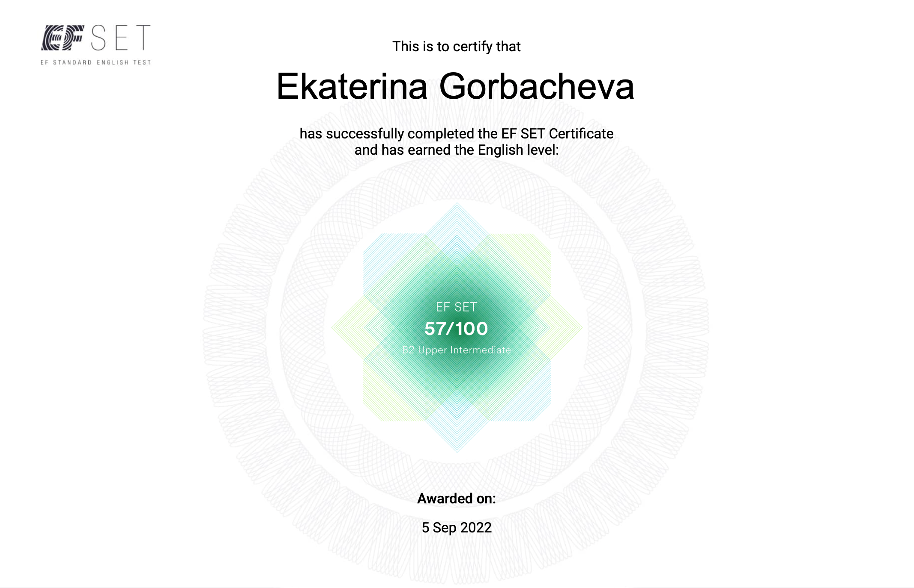

# Ekaterina Gorbacheva

_Contact_ | &nbsp;
------|:-------:
 | +(48)797372412
 | e.gorbacheva404@gmail.com
 | Ekaterina Gorbacheva (@kavume) 


## _**About me**_

My name is Ekaterina Gorbacheva. I've started my professional career path in IT sphere in 2018. I had been working as a web designer (a freelancer) for 3 years and then I realised that a stage of developing of web sites is more interesting for me.

I'm a self-motivated, patient person. It helps me to succeed in the chosen profession. 
 
My strengths also include an open-mindedness, self-management and time management, teamwork, flexibility, listening skills.

## _**Skills**_
Coding languages: 
* HTML5
* CSS
* JavaScript (Core)

VCS:
* Git, Github

Editors:
* VS Code
* WebStorm

Graphics software:
* Adobe Photoshop 
* Adobe Illustrator
* Procreate
* Figma
* Sketch

Others:
* Notion
* Miro

## _**Code example**_
>_The Kata bellow is taken from a Codewars_

___Description:___

Define a function that takes an integer argument and returns a logical value true or false depending on if the integer is a prime.

>Per Wikipedia, a prime number ( or a prime ) is a natural number greater than 1 that has no positive divisors other than 1 and itself.

___Requirements___:

* You can assume you will be given an integer input.

* You can not assume that the integer will be only positive. You may be given negative numbers as well ( or 0 ).

* __NOTE on performance:__ There are no fancy optimizations required, but still the most trivial solutions might time out. Numbers go up to 2^31 ( or similar, depending on language ). Looping all the way up to n, or n/2, will be too slow.

```
function isPrime(num) {
  
  if ( num <= 1 ) return false;

  let n =  Math.sqrt(num);
  
  for (let i = 2; i <= n; i++) {
    if ( num % i === 0) {
      return false; 
    } 
  }

  return true;
}
```
## _**Project**_
>Click the link bellow for viewing project

[CV](https://kavume.github.io/rsschool-cv/cv) &nbsp; 

## _**Education**_
* «JavaScript/Front-end. Stage 0» (self-study)
* «JavaScript/Front-end. Stage 1» (in progress)
* [freeCodeCamp](https://www.freecodecamp.org/) (HTML,CSS,JS courses)
* [W3Schools](https://www.w3schools.com/), [developer.mozilla.org](https://developer.mozilla.org/en-US/)
* [learn.Javascript.ru](https://learn.javascript.ru/)

## _**Languages**_
* English (B2 Upper Intermediate - according to the EF SET)



* Russian (Native)

* Belarussian (Intermediate)

* Polish (Beginner)